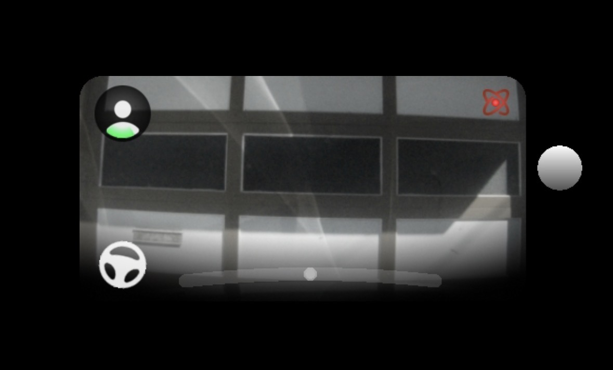

# sunnypilot DEC / Experimental Mode HUD Indicator

Adds a small on-screen icon to the sunnypilot MICI HUD so you can tell at a glance when **Experimental Mode** is active.




## What It Does

- Displays a small **atom icon** (28×28) in the top-right corner of the HUD
- Triggers when:
  - `selfdriveState.experimentalMode` is `True` (manual toggle via long-press gap button), **or**
  - DEC (Dynamic Experimental Control) switches to **blended** mode (`longitudinalPlanSP.dec.state == blended`)
- Uses the existing `icons_mici/experimental_mode.png` asset — no new images needed

## Requirements

- **sunnypilot** with MICI UI layout (current default)
- **Comma 3, 3X, or 4** hardware
- DEC indicator uses `longitudinalPlanSP.dec` — requires sunnypilot builds with DEC support

## Installation

1. **SSH into your comma:**
   ```bash
   ssh comma@<your-comma-ip>
   ```

2. **Back up the original file:**
   ```bash
   cp /data/openpilot/selfdrive/ui/sunnypilot/mici/onroad/hud_renderer.py \
      /data/openpilot/selfdrive/ui/sunnypilot/mici/onroad/hud_renderer.py.bak
   ```

3. **Copy the modified file:**
   ```bash
   # From your computer:
   scp hud_renderer.py comma@<your-comma-ip>:/data/openpilot/selfdrive/ui/sunnypilot/mici/onroad/hud_renderer.py
   ```

4. **Recompile the bytecache** (critical — Python won't pick up changes without this):
   ```bash
   ssh comma@<your-comma-ip>
   cd /data/openpilot
   python3 -c "
   import py_compile
   src = 'selfdrive/ui/sunnypilot/mici/onroad/hud_renderer.py'
   pyc = 'selfdrive/ui/sunnypilot/mici/onroad/__pycache__/hud_renderer.cpython-312.pyc'
   py_compile.compile(src, pyc, doraise=True)
   print('Bytecache compiled successfully')
   "
   ```
   > ⚠️ Adjust `cpython-312` to match your Python version if different.

5. **Reboot** the comma (or restart the UI process).

## How It Works

The file extends sunnypilot's `HudRenderer` class (MICI layout) via `HudRendererSP`. The `_draw_dec_indicator()` method hooks into the existing `_render()` pipeline and checks:

- **Experimental mode** from `selfdriveState.experimentalMode`
- **DEC blended state** from `longitudinalPlanSP.dec` (active + state raw == 1)

Uses the existing `experimental_mode.png` icon texture already bundled with sunnypilot. No additional assets required.

## Notes

- **Survives reboots** but NOT sunnypilot updates (updates replace `/data/openpilot/`). Re-apply after updating.
- The icon is small and unobtrusive — won't block your driving view.
- All rendering errors are silently caught to avoid crashing the UI.
- Tested on **Comma 4 + 2017 Lexus RX350 (TSS-P)** with Smart DSU.

## License

MIT — same as sunnypilot.
